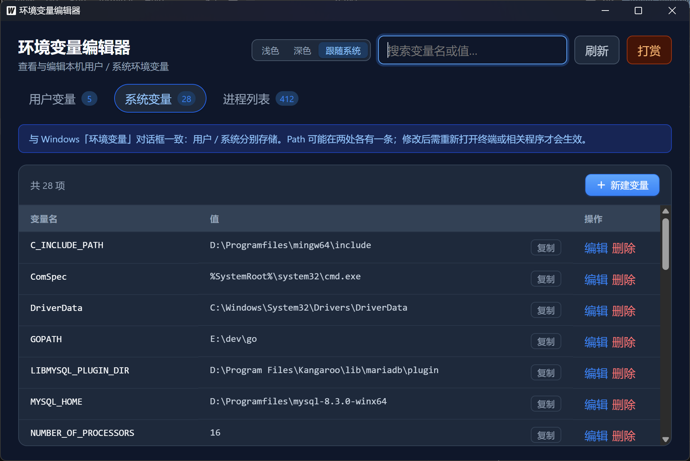

# 环境变量编辑器

基于 **Wails v2 + Vue 3** 的 Windows 桌面应用，用于查看和编辑本机环境变量。

**GitHub**：https://github.com/lzsbee/env-editor

## 下载

- **项目主页**：https://github.com/lzsbee/env-editor
- **源码**：`git clone https://github.com/lzsbee/env-editor.git`
- **exe 下载**：https://github.com/lzsbee/env-editor/releases

> 编辑系统变量时，请右键 exe → **以管理员身份运行**。

## 界面预览

### 主界面

用户 / 系统变量、进程列表、主题切换等。



## 功能

- 查看 / 编辑 **用户变量**、**系统变量**
- **进程列表**：查看端口、环境变量，结束进程
- Path 列表编辑、路径拆分
- 系统变量保存时弹出 UAC 授权
- 浅色 / 深色 / 跟随系统主题
- 搜索过滤、复制变量值
- 修改后广播 `WM_SETTINGCHANGE`，通知其他程序刷新环境

## 环境要求

- [Go 1.22+](https://go.dev/dl/)
- [Node.js 18+](https://nodejs.org/)
- [Wails CLI v2](https://wails.io/docs/gettingstarted/installation)

```powershell
go install github.com/wailsapp/wails/v2/cmd/wails@latest
```

## 开发运行

```powershell
git clone https://github.com/lzsbee/env-editor.git
cd env-editor
go mod tidy
go build -ldflags "-H windowsgui -s -w" -o elevhelper.exe ./cmd/elevhelper
wails dev
```

## 构建发布

```powershell
go build -ldflags "-H windowsgui -s -w" -o elevhelper.exe ./cmd/elevhelper
wails build
```

产物位于 `build/bin/env-editor.exe`。

## 项目结构

```
├── main.go
├── app.go
├── internal/           # 环境变量、进程、UAC 等功能
├── cmd/elevhelper/     # UAC 提权助手
├── docs/images/        # README 说明截图（overview、tip_me 等）
├── frontend/
│   ├── src/
│   └── assets/imgs/    # 打赏二维码
└── wails.json
```

## 技术说明

- 用户变量：`HKCU\Environment`
- 系统变量：`HKLM\SYSTEM\CurrentControlSet\Control\Session Manager\Environment`

## 支持作者

如果这个工具对你有帮助，欢迎扫码支持。你的鼓励是我继续维护和改进的动力，非常感谢。


